<h1 align="center">🟥 Red Polish</h1>
<h2 align="center">Enterprise E-Commerce & Service Booking Platform</h2>

  Arquitectura full-stack profesional diseñada para escalar, integrar múltiples pasarelas de pago y gestionar productos + servicios en un mismo ecosistema digital.

  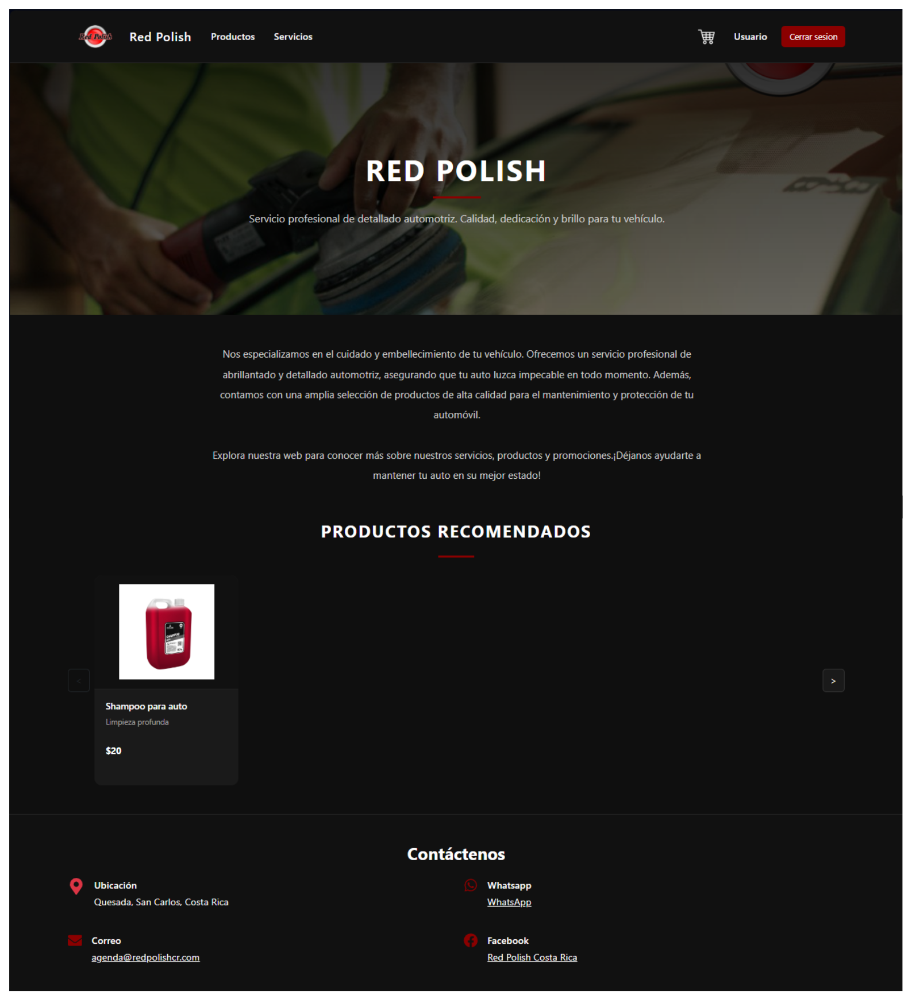

  
  
  
  
  
  
  

---

# 🧠 Executive Overview

Red Polish es una plataforma digital híbrida que combina:

- 🛍 **E-commerce tradicional**
- 👤 **Reserva de servicios con control de disponibilidad**
- 💳 **Pasarela de pagos múltiples**
- 🔐 **Autenticación segura basada en JWT**
- 🎯 **Sistema dinámico de promociones**
- 🌎 **Internacionalización**
- 🛒 **Carrito persistente sincronizado**

El proyecto fue desarrollado con mentalidad de <strong>producto real</strong>, aplicando:

- Principios de arquitectura limpia  
- Separación por capas  
- DTO Pattern  
- Seguridad empresarial  
- Escalabilidad futura  

---

# 🏗 Arquitectura de Alto Nivel

  <strong>React + TypeScript (SPA)</strong> 
  ↓ 
  <strong>REST API</strong> 
  ↓ 
  <strong>Spring Boot (Security + Business Logic)</strong> 
  ↓ 
  <strong>PostgreSQL</strong>

---

## 🔎 Stack Tecnológico

| Capa | Tecnología | Rol |
|------|------------|------|
| Frontend | React + Vite + TypeScript | SPA optimizada |
| Backend | Spring Boot | API REST robusta |
| Seguridad | Spring Security + JWT | Autenticación stateless |
| Base de Datos | PostgreSQL | Persistencia relacional |
| Pagos | SINPE | Procesamiento financiero |
| i18n | i18next | Soporte multi-idioma |

---

# 🔐 Seguridad Empresarial

Implementación basada en estándares modernos:

- Autenticación stateless con JWT  
- Filtros personalizados (`JwtAuthFilter`)  
- Encriptación con BCrypt  
- Protección de rutas privadas  
- Control de acceso por roles  
- Recuperación de contraseña vía email   

---

# 🛍 E-Commerce Engine

Sistema completo de comercio electrónico:

- CRUD de productos  
- Categorización dinámica  
- Asociación con promociones  
- Vista detallada de producto  
- Checkout integrado  
- Persistencia de carrito en base de datos  
- Asociación de compras a usuario  

 

  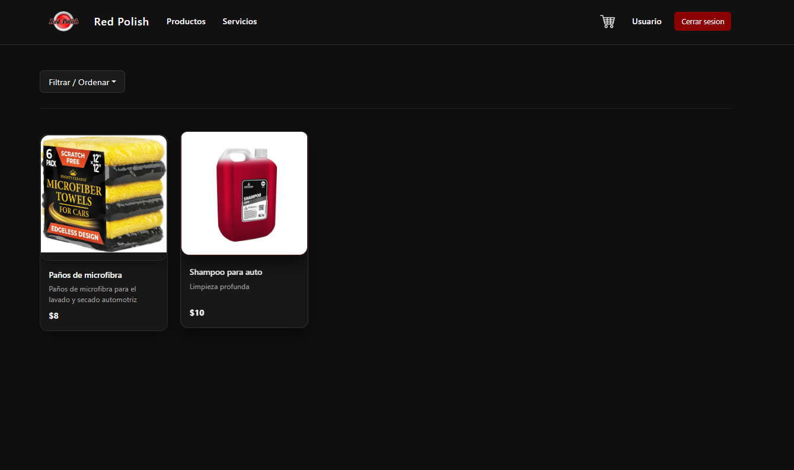
  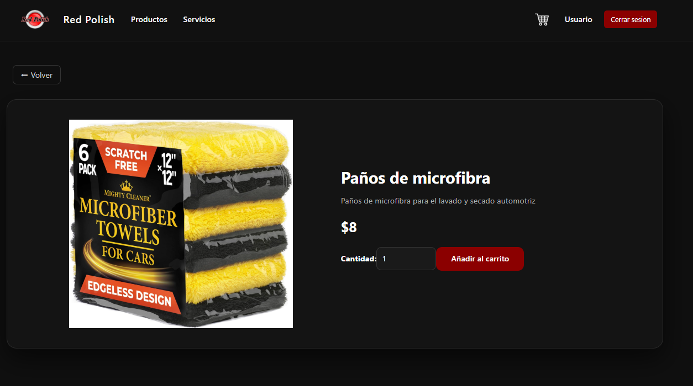
  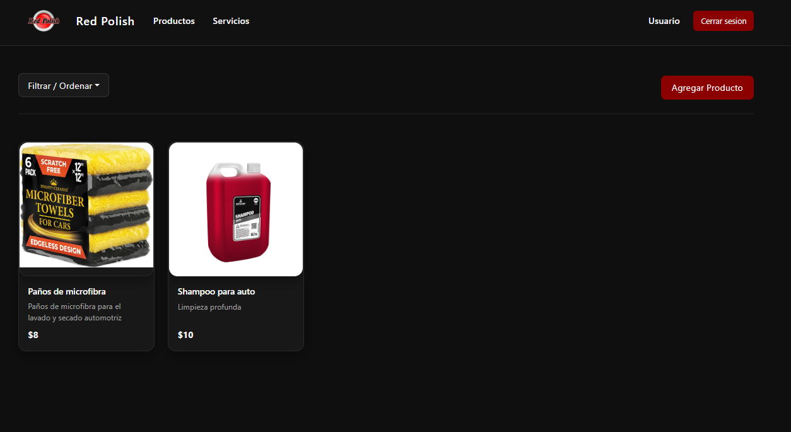

  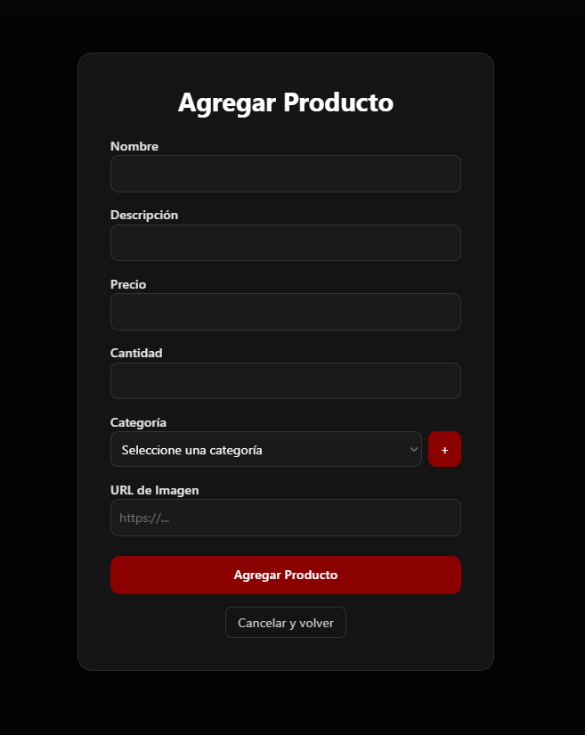
  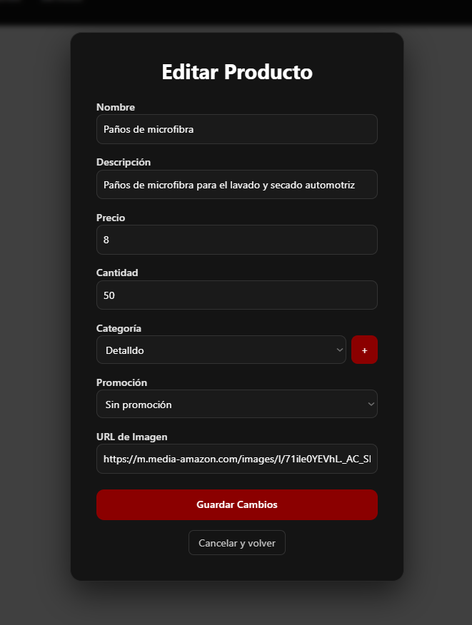

---

# 👤 Service Booking System

Módulo especializado para reservas profesionales:

- Selección de fecha  
- Validación de disponibilidad  
- Prevención de colisiones  
- Gestión de días bloqueados (BusyDay)  
- Asociación de cita a usuario  
- Administración completa desde backend  

Este módulo transforma el sistema en una <strong>plataforma híbrida producto + servicio</strong>, aumentando su valor comercial.

 

  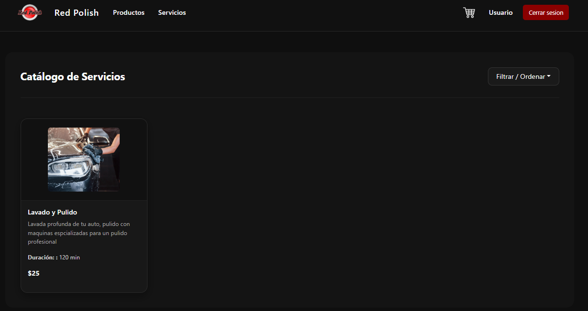
  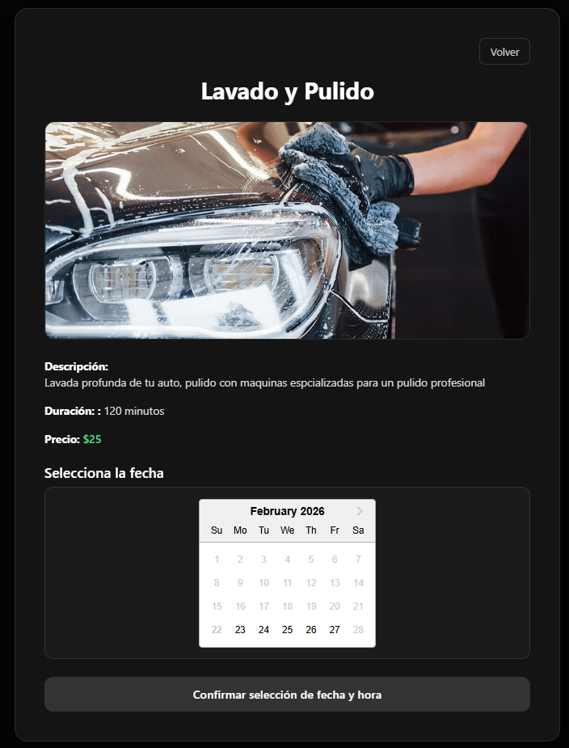
  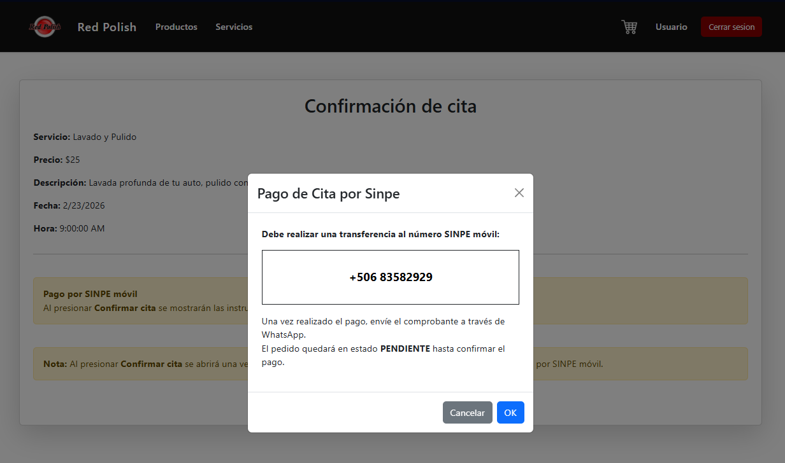

  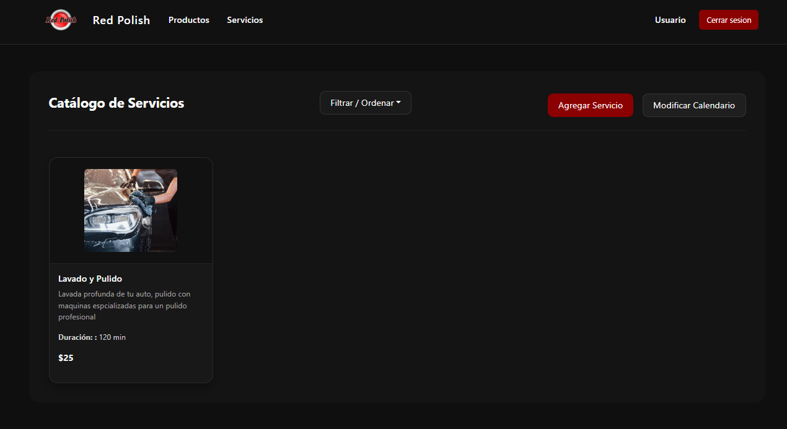
  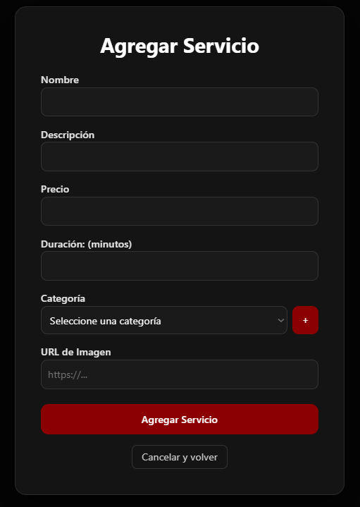
  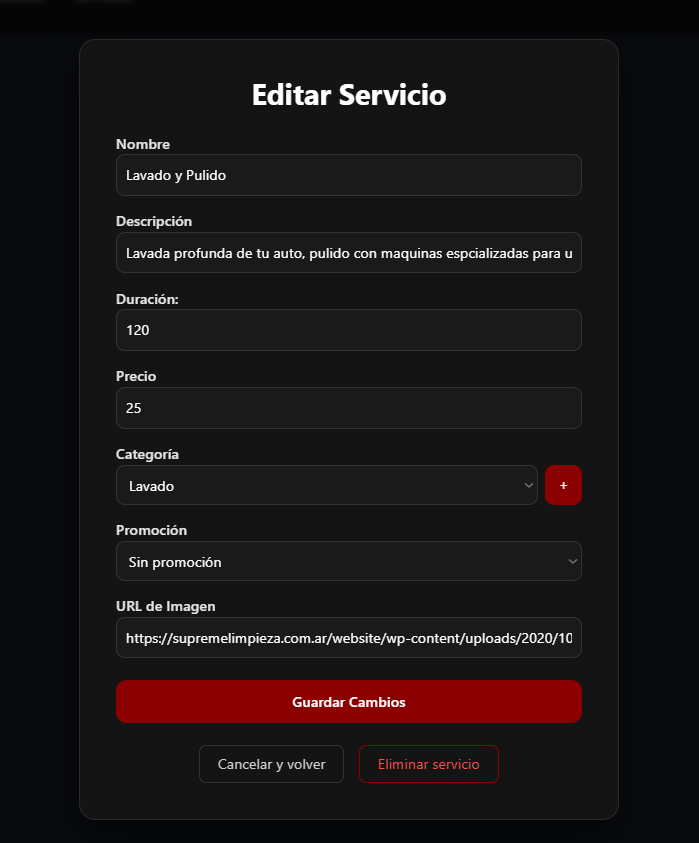
  

---

# 🛒 Cart & Payment Integration

Módulo unificado que gestiona el flujo completo de compra: desde la persistencia del carrito hasta la confirmación del pago.

## 🛍 Carrito Persistente

- Sincronización con backend  
- Persistencia por usuario autenticado  
- Actualización dinámica de cantidades  
- Integración directa con checkout  
- Cálculo automático de promociones  

Garantiza continuidad de compra y consistencia de datos entre sesiones.

 

  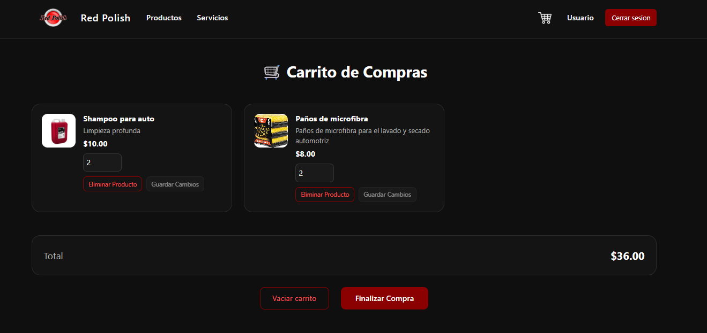

---

## 💳 Payment Integration (SINPE Ready)

Implementación inicial con **SINPE Móvil**, integrada a solicitud de stakeholders como solución local prioritaria.

Arquitectura preparada para:

- Integrar futuras pasarelas (Stripe / PayPal / etc.)  
- Implementar Webhooks  
- Validar transacciones  
- Registrar automáticamente la compra tras confirmación  

Diseñado para escalar hacia un sistema multi-gateway sin refactorizaciones críticas.

 

  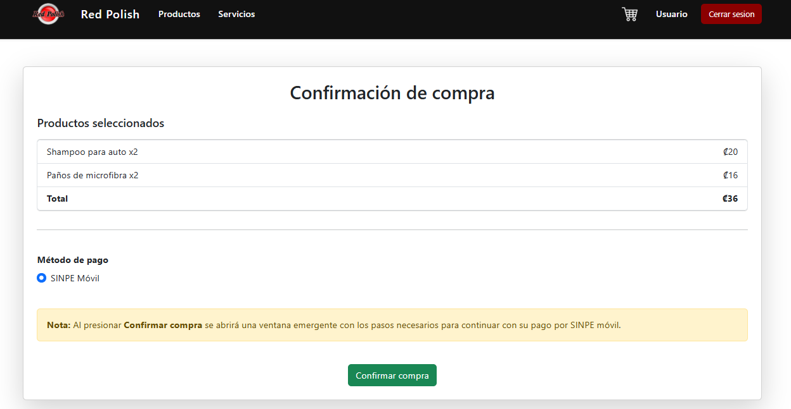
  
  

---

# 👤 User Management & Account Dashboard

Panel centralizado de gestión de usuario con arquitectura basada en roles y control dinámico de funcionalidades.

El módulo permite a cada usuario administrar su información, historial y preferencias desde un entorno seguro y segmentado.

  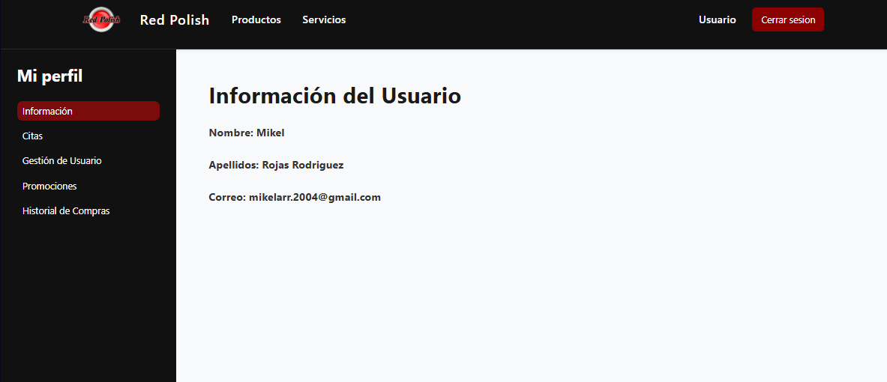

---

## 🔐 Account Management

- Actualización de nombre y apellido  
- Cambio seguro de contraseña  
- Persistencia de sesión mediante JWT  
- Confirmación previa antes de cambios críticos  
- Sincronización inmediata con contexto global de autenticación  

Diseñado bajo principio de **seguridad primero**, evitando inconsistencias de estado y accesos no autorizados.

 

  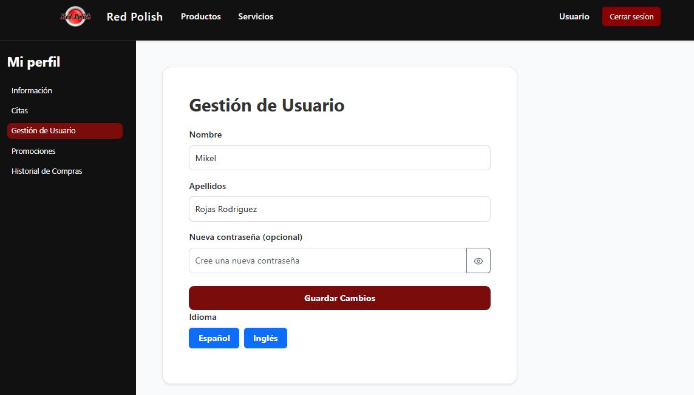

---

## 📅 Appointments Control

- Visualización de citas personales  
- Vista administrativa global (según rol)  
- Gestión diferenciada para usuarios y administradores  

Implementado con renderizado condicional por rol.

 

  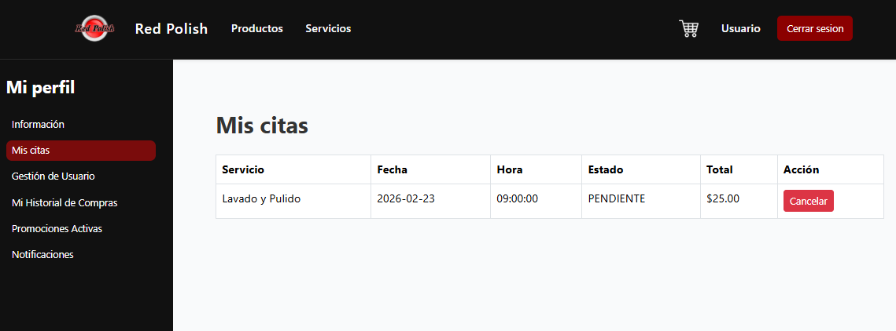
  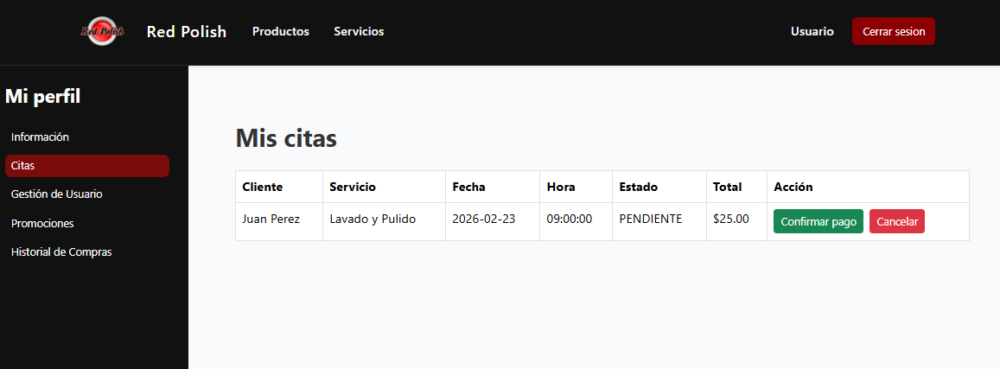

---

## 🎯 Promotion Management (Admin)

Panel administrativo completo para promociones:

- CRUD  promociones  
- Gestión de fechas de vigencia  
- Control de porcentaje de descuento  
- Envío de correos promocionales  
- Actualización dinámica sin recarga  

Sistema preparado para escalar hacia campañas automatizadas.

 

  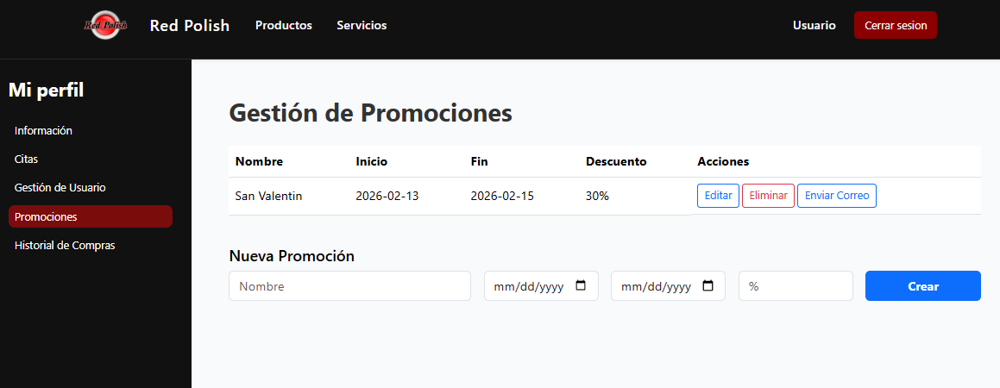

---

## 📦 Purchase History

Historial estructurado de compras con:

- Visualización por usuario  
- Vista global para administrador  
- Estado de pago (PENDIENTE / CONFIRMADA / EXITOSO)  
- Confirmación manual de pagos SINPE  
- Información detallada de cliente  

Permite control financiero básico sin requerir dashboard externo.

 

  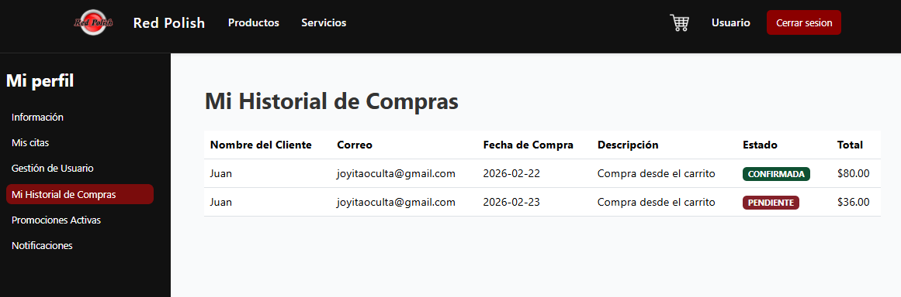
  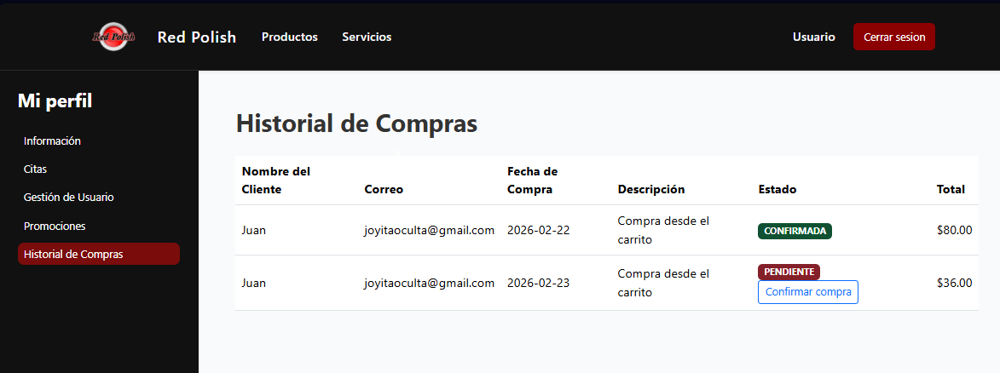

---

# 🧩 Backend Architecture Design

Separación por capas siguiendo principios SOLID:

Controller
Service
ServiceImpl
Repository
Entity
DTO
Mapper
Config
Exception

### Beneficios

- Bajo acoplamiento  
- Alta mantenibilidad  
- Escalabilidad 
- Claridad en responsabilidades  

---

# 📈 Escalabilidad y Proyección

La arquitectura actual permite evolucionar hacia:

- Dashboard administrativo con métricas  
- Sistema avanzado de inventario  
- Notificaciones en tiempo real  
- Sistema de fidelización  
- Marketplace multi-vendedor  
- Migración a microservicios  
- Dockerización y CI/CD  
- Suscripciones recurrentes  

El diseño no es solo académico: está pensado para crecimiento real.

---

# ⚙️ Ingeniería Aplicada

Este proyecto demuestra dominio en:

- Diseño de APIs REST  
- Seguridad con Spring Security  
- Arquitectura limpia  
- Facilitación de pagos por SINPE
- Manejo avanzado de estado en React  
- Internacionalización  
- Persistencia relacional optimizada  
- Manejo centralizado de errores  
- Separación frontend/backend  

